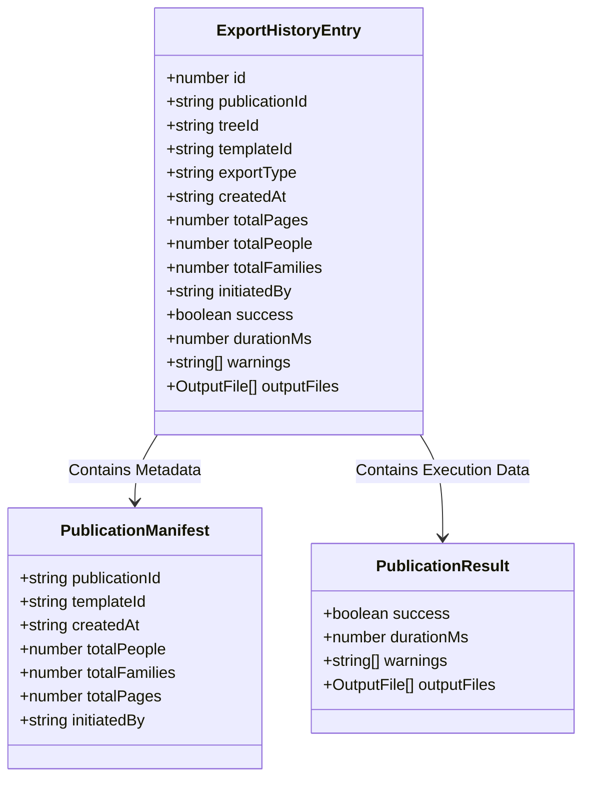

# ADR-001: Publication Manifest & Export History Architecture

## Status
Accepted (June 2026)

## Context
When a user performs any export operation—whether legacy data formats (GEDCOM, JSON, ICS, Print) or visual/publishing formats (Ahnentafel tree posters, paginated manuscripts)—the application executes the operation in a fire-and-forget manner. There is no telemetry, local logging, or history recorded. 

As the application moves towards Jozor 2.0 (collaborative features, citation engines, and premium printing), it is critical to have:
1. An audit trail of what was exported, when, by whom, and from which tree.
2. Analytics and performance measurements (e.g., generation time in ms) to trace regressions.
3. Troubleshooting logs, such as capturing warnings generated during export.

## Decision
We will establish a unified export tracking infrastructure using the **Manifest & Result Pattern**:

1. **PublicationManifest**: Captures the input metadata, scoping parameters, and scale of the export (e.g., number of people, number of families, templates used, page count) *before* or *during* processing.
2. **PublicationResult**: Captures execution metrics (success status, duration, warnings, generated output files and sizes) *after* processing.
3. **ExportHistoryEntry**: Merges the manifest and result into a single persistent record, including `treeId` and `exportType` ('legacy' | 'publishing') to distinguish traditional data file downloads from engine-driven published materials.
4. **IndexedDB Schema Version 4**: Upgrades the Dexie schema to introduce an `export_history` store:
   `export_history: '++id, publicationId, treeId, templateId, exportType, createdAt'`
5. **Zustand Slice**: Creates a dedicated state slice `exportHistorySlice` to load, append, and clear history logs in the app UI state.

### Data Model Visual Structure

## Consequences
* **Database Upgrade**: Dexie database version is incremented to 4. This adds a new store `export_history`. It does not touch or modify existing tables (`people`, `settings`, `pending_operations`, `person_tombstones`), meaning it is backwards-compatible. Testing migration on a copy of real user data is required.
* **Separation of Concerns**: The tracking logic is encapsulated in a dedicated `PublishingTracker` service, preventing pollution of the export/rendering logic.
* **UI Integration**: The Zustand slice provides a clean API for reading, adding, or purging history records.
