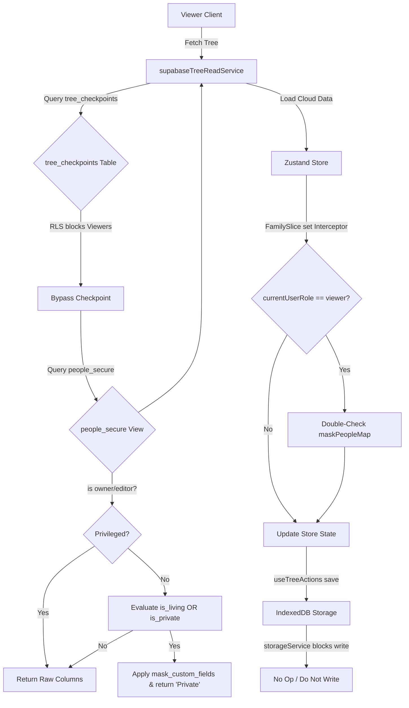

# ADR-005: Living Person Privacy Layer

## Status
Proposed (June 2026)

## Context
In Jozor, users can invite others to view their family trees. There are three roles: owner, editor, and viewer.
A critical requirement is protecting the privacy of living relatives and members explicitly marked as private. When a user with the viewer role (or an anonymous visitor) views the tree:
1. **Dynamic Masking**: Sensitive personal details (names, dates, places, gallery, contact details, bio, and events) of living relatives must be dynamically masked.
2. **Structural Preservation**: The structural connections of the tree (parents, spouses, children, gender, etc.) must remain fully intact so the viewer can still see and navigate the tree chart correctly.
3. **Security-by-Default (Network & Storage)**: Raw sensitive details must never traverse the network for a viewer session. Viewers must also be blocked from downloading raw tree_checkpoints containing full serialized nested JSON of the tree.
4. **Local DB Integrity**: Viewers must never cache raw details into local IndexedDB storage.

## Decision
We will implement a dual-layer Living Person Privacy Layer that operates at both the Supabase API (RLS/Views) level and the Zustand Frontend State level.

### 1. Privacy Policy Definition
A person is classified as living/alive by default unless:
- They are explicitly marked as deceased (isDeceased: true or (custom_fields->>'isDeceased')::boolean = true).
- They have a non-empty deathDate (or death_date column is not null).
- Their age calculated from birthDate (or birth_date column) exceeds 110 years.

A person must be masked if they are living OR if they are explicitly marked as private (isPrivate: true or (custom_fields->>'isPrivate')::boolean = true).

### 2. Database-Level Security (Supabase API)
To prevent raw details from traversing the network, we will enforce masking at the PostgreSQL level:
- **Block Direct SELECT on people for Viewers**: Modify the Row Level Security (RLS) policy people_collaborator_read on the people table to only allow users with the editor role (or tree owner).
- **Secure View (people_secure)**: Create a security-definer view public.people_secure owned by postgres (bypassing RLS internally). The view dynamically masks columns based on the current user's privileges:
  - If the user is the tree owner or a collaborator with the editor role, the view returns the raw database values.
  - If the user is a viewer (or anonymous/visitor) AND the person is living or private, the view masks the columns (names replaced with 'Private', dates/places/etc. set to NULL or empty strings).
- **Masking Custom Fields**: Implement a PostgreSQL function public.mask_custom_fields(p_custom_fields JSONB) to strip sensitive fields (gallery, voiceNotes, sources, events, birth/death sources, marriage details, etc.) and construct a clean masked JSONB object.
- **Restrict Checkpoint Access**: Modify the SELECT policy on tree_checkpoints (checkpoints_collaborator_read) to require the editor role (or tree owner). Since viewers cannot read checkpoints, they will naturally and gracefully trigger the frontend fallback that queries the people_secure view directly.

### 3. Frontend-Level Security (Zustand & IndexedDB)
As the final line of defense and to handle real-time sync updates or local-first loads:
- **Zustand Interceptor**: In src/store/slices/familySlice.ts, modify the custom set wrapper. If currentUserRole === 'viewer', any update to people or confirmedPeople is automatically intercepted and passed through a frontend masking utility maskPeopleMap.
- **Reactive Role Transition**: If the user's role transitions to 'viewer' (e.g. during sync or auth updates), the interceptor immediately masks the active in-memory tree state.
- **Local Storage Guard**: In src/services/storageService.ts, check the active currentUserRole. If the role is 'viewer', all write/save operations to the local IndexedDB (saveFullTree, savePeople, savePerson, recordDeletedPersonId, etc.) will immediately return without modifying local storage. This guarantees that viewers never write masked data back or store raw cached details.

### 4. Masked Fields Specification
When a person is masked:
- firstName -> 'Private'
- lastName, middleName, birthName, nickName, title, suffix -> ''
- birthDate, birthPlace, birthSource -> ''
- marriageDate, marriagePlace -> '' / undefined
- deathDate, deathPlace, deathSource, burialPlace -> ''
- residence, currentResidence -> '' / undefined
- bio, profession, company, interests, occupation, workplace -> '' / undefined
- photoUrl, photoPath, photoVersion -> undefined
- gallery, voiceNotes, sources, events -> []
- email, website, blog, address -> ''
- partnerDetails -> Dates and places cleared, keeping only relationship types.
- metadata -> Masked or stripped of sensitive updates.

## Data Flow Diagram

## Consequences
- **Absolute Privacy**: Sensitive personal data of living members is completely secured from viewers.
- **Zero Raw Data Leakage**: Viewers cannot retrieve raw records via direct API queries, checkpoints, or IndexedDB storage.
- **Consistent Charts**: The tree rendering engine functions perfectly since ID-based relationships and gender properties are preserved.
