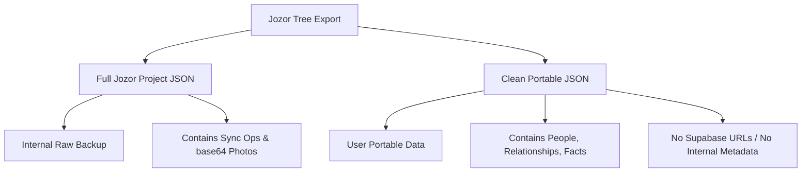

# Clean Portable JSON Export - Design Note

**Date:** July 7, 2026  
**Status:** `Proposed`  
**Author:** Owner / Antigravity

---

## 1. Product Boundary

To prevent privacy leakage and project metadata leakage while offering convenient portable data exports to users, Jozor will divide JSON exports into two distinct formats:

---

## 2. Technical Specifications

### Full Jozor Project JSON
- **Purpose:** Full project backup and recovery.
- **Scope:** Includes UI layouts, client settings, detailed sync operations history, client IDs, raw base64 media blocks, and cloud storage URLs.
- **UX Labeling:** Labeled clearly as `ملف مشروع جوزور الكامل (نسخة احتياطية)` in the UI.

### Clean Portable JSON
- **Purpose:** Shareable, lightweight, privacy-preserving public export.
- **Schema:**
  - **Included:**
    - People array with sanitized names, gender, bio, and vital events.
    - Relationships array (spouse and parent-child edges) matching standard schemas.
    - Source and citations catalog.
    - Export timestamp, app version (simplified), and tree identifier.
  - **Excluded:**
    - `photoUrl`, `photoPath`, and embedded base64 media.
    - Suppressed client sync properties (`lastUpdated`, `lastUpdatedOps`, `client_id`).
    - Supabase cloud storage endpoints and keys.
    - Suppressed empty metadata blocks.
- **Date Precision:**
  - Standardizes dates to represent their true input precision:
    - Year-only: `1977`
    - Month-year: `1977-03`
    - Exact: `1977-03-15`
    - Approximate: `ABT 1977`
