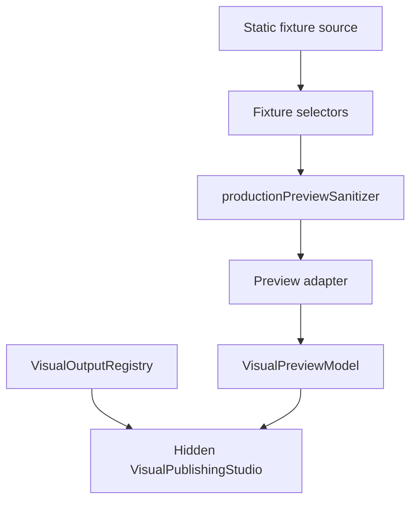

# Visual Publishing Studio Foundation Closure Review

- **Status**: `Pass as Hidden Studio Foundation`
- **Readiness**: `Ready for Future Gated Runtime Integration`
- **User Exposure**: `Not Ready / Hidden by Flag`
- **Date**: 2026-07-09

---

## 1. Scope

This review closes the current Visual Publishing Studio foundation package.

It covers:

- hidden Studio shell
- registry-backed template defaults
- read-only selector state
- static visual compositions
- preview adapter contracts
- sanitizer contracts and mock/production sanitizers
- fixture selectors
- minimal poster and snapshot live selectors
- pure live source mapper
- hidden fixture selector wiring into the Studio

---

## 2. Completed Architecture



The Studio now exercises the real preview pipeline with fixture data, while remaining hidden from users.

---

## 3. Safety Checklist

| Requirement | Status |
|---|---|
| Studio hidden behind `SHOW_VISUAL_STUDIO_SHELL = false` | Verified |
| Current Visual Output cards remain active | Verified |
| Export handlers unchanged | Verified |
| Action buttons disabled | Verified |
| No live `useAppStore` subscription | Verified |
| No IndexedDB reads | Verified |
| No runtime selector registry activation | Verified |
| Sanitizer required before adapter ingestion | Verified |
| Preview IDs generated independently | Verified |
| Contact fields excluded from mapper inputs | Verified |
| Media URLs/paths excluded from mapper inputs | Verified |
| Living/private masking preserved | Verified |

---

## 4. Product Decision

The Studio foundation is complete for this architectural milestone.

It should remain hidden for Limited Beta until a separate implementation pass covers:

- gated runtime store bridge
- debounced/cancellable preview updates
- owner review of real-tree preview behavior
- visual QA inside the Vault UI
- activation flag decision

---

## 5. Next Milestone

Recommended next milestone, when ready:

```text
Visual Publishing Studio Runtime Preview Activation Pack
```

That pack should be treated as a new release gate, not as part of this foundation closure.
