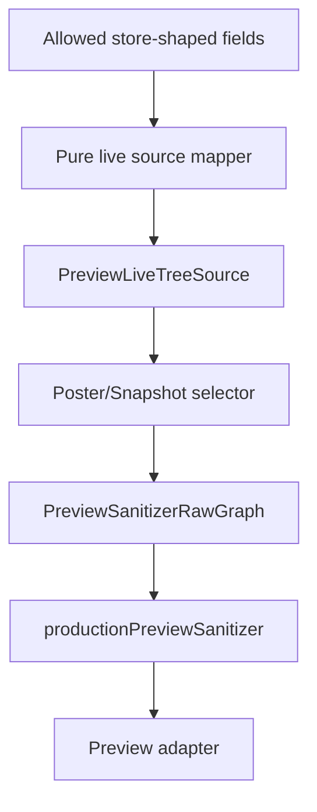

# Visual Publishing Studio Hidden Live-Source Wiring Plan

- **Status**: `Planning Complete`
- **Scope**: Pure source-mapper bridge only
- **Connectivity**: `No Store Subscription / No IndexedDB Reads`
- **Date**: 2026-07-09

---

## 1. Objective

Define the smallest safe bridge from store-shaped fields into the existing preview selector boundary.

The bridge is intentionally not a store hook. It is a pure mapping contract that receives only explicitly allowed fields and returns `PreviewLiveTreeSource`.

---

## 2. Approved Data Flow



---

## 3. Safety Rules

- The mapper input type must exclude email, phone, address, notes, source text, metadata, photo URLs, and file paths.
- The mapper may accept `hasProfilePhoto` as a boolean only.
- The mapper must not import `useAppStore`, IndexedDB helpers, or domain `Person` objects.
- Product selectors remain responsible for root/depth or visible-node slicing.
- Sanitizer remains mandatory after selector output.

---

## 4. Decision

Proceed with:

```text
Phase 4S - Pure Live Source Mapper
```

This phase validates the handoff shape before any hidden runtime store wiring is attempted.
