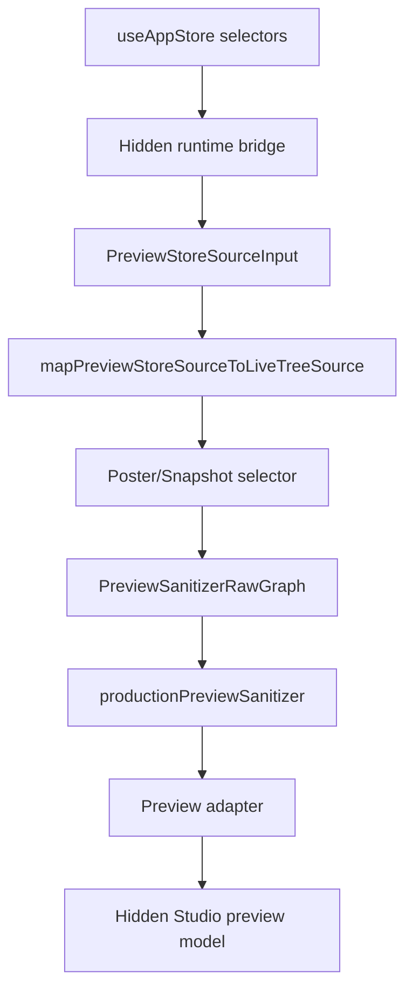

# Visual Publishing Studio Hidden Runtime Store Wiring Plan

- **Status**: `Planning Complete / Runtime Wiring Deferred`
- **Scope**: Future hidden store subscription boundary
- **Connectivity**: `No Runtime Store Wiring Implemented`
- **Date**: 2026-07-09

---

## 1. Purpose

Define the last safety gate before the Visual Publishing Studio reads live application state.

The Studio foundation is now able to consume:

```text
source input -> live source mapper -> product selector -> production sanitizer -> preview adapter -> Studio telemetry
```

The remaining risk is not the preview pipeline. The remaining risk is **when and how** live app state is read.

---

## 2. Required Runtime Boundary

Future runtime store wiring must be isolated in a small hook or selector bridge. It must:

- read only the active tree fields needed by the preview source mapper
- map immediately into `PreviewStoreSourceInput`
- avoid passing domain `Person` or relationship objects downstream
- debounce selection changes
- cancel stale preview builds
- keep profile photos disabled by default
- preserve `SHOW_VISUAL_STUDIO_SHELL = false` until a separate activation decision

---

## 3. Approved Future Runtime Flow



---

## 4. Explicitly Deferred

- enabling the Visual Publishing Studio in the Vault UI
- direct user interaction with live preview output
- runtime selector registry activation
- reading IndexedDB directly
- rendering real profile photos
- calling export handlers from Studio buttons

---

## 5. Decision

Do not implement runtime store wiring in this pass.

The safe closure for the current milestone is:

```text
Phase 4U - Visual Publishing Studio Foundation Closure Review
```

That review should mark the Studio as architecturally ready for a later gated runtime integration pass, while still not ready for user exposure.
