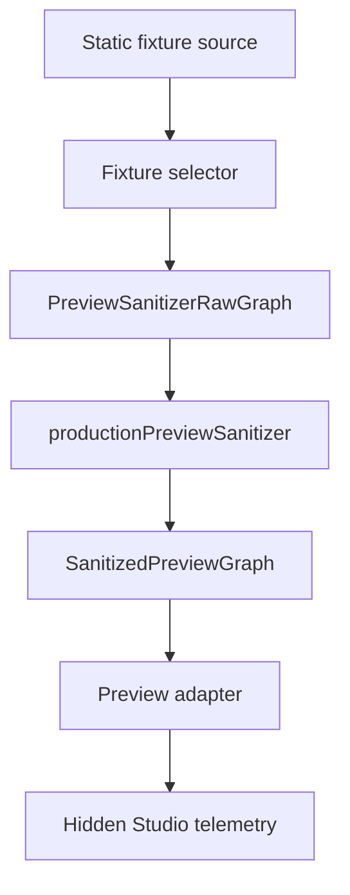

# Visual Publishing Studio Hidden Selector Wiring Plan

- **Status**: `Planning Complete`
- **Scope**: Hidden Studio selector-chain wiring only
- **Connectivity**: `Fixture Source Only / No Store Reads`
- **Date**: 2026-07-09

---

## 1. Objective

Plan the first safe Studio wiring step after the selector layer passed review.

The goal is to make the hidden Studio consume the same selector -> sanitizer -> adapter pipeline that future live previews will use, while keeping all inputs static and local:



---

## 2. Approved Boundaries

| Boundary | Decision |
|---|---|
| Studio visibility | Remains hidden behind `SHOW_VISUAL_STUDIO_SHELL = false`. |
| Source data | Static fixture source only. |
| Store access | Blocked. No `useAppStore`, Redux selector, IndexedDB, or tree runtime reads. |
| Runtime selector registry | Remains inactive. |
| Export handlers | Not called and not passed into Studio. |
| Action buttons | Stay disabled. |
| Photos | Disabled in preview policy. |
| Privacy mode | `masked`. |

---

## 3. Implementation Direction

The hidden Studio may:

- import fixture selectors and `productionPreviewSanitizer`
- build a `SanitizedPreviewGraph` from static fixture nodes
- pass that graph into the existing poster/snapshot preview adapters
- render telemetry and warning states from the resulting `VisualPreviewModel`

The hidden Studio must not:

- subscribe to `useAppStore`
- read active tree people or relationships
- import IndexedDB helpers
- register live selectors for runtime lookup
- call PNG/PDF export handlers

---

## 4. Decision

Proceed to:

```text
Phase 4Q - Hidden Studio Fixture Selector Wiring
```

This phase is safe because it exercises the future live-preview pipeline with static, privacy-safe fixture data only.
