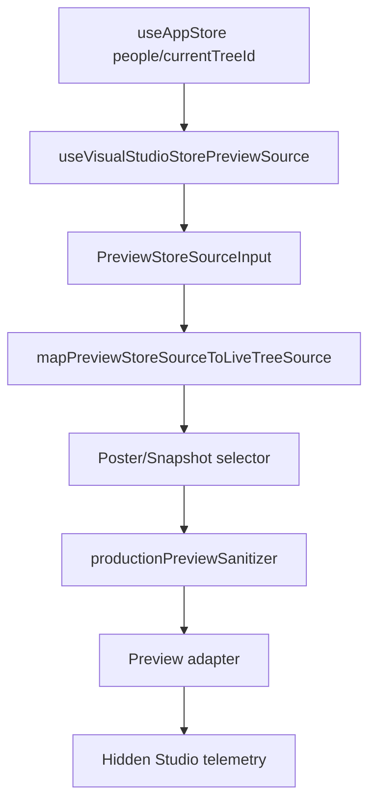

# Visual Publishing Studio Hidden Store Bridge Review

- **Status**: `Pass as Hidden Store Bridge Skeleton`
- **Readiness**: `Ready for Gated UI Exposure Planning`
- **User Exposure**: `Still Hidden`
- **Date**: 2026-07-09

---

## 1. Scope

This review covers the first optional hidden bridge from application store state into the Visual Publishing Studio preview pipeline.

The bridge is only activated when `VisualPublishingStudio` is explicitly rendered with:

```tsx
previewSourceMode="store"
```

The Vault export panel now passes this mode for owner/internal review. Studio export actions remain disabled and existing export cards remain available below the Studio.

---

## 2. Runtime Flow



---

## 3. Safety Constraints

| Constraint | Status |
|---|---|
| Studio appears in Vault Visual Outputs for owner review | Verified |
| Store bridge is used by the visible owner-review Studio | Verified |
| Store bridge is isolated in `useVisualStudioStorePreviewSource` | Verified |
| Contact details are not mapped | Verified |
| Notes, citations, event text, and metadata are not mapped | Verified |
| Media URLs/paths become only `hasProfilePhoto` boolean | Verified |
| Sanitizer still masks living/private people | Verified |
| Export handlers remain disconnected | Verified |
| Action buttons remain disabled | Verified |

---

## 4. Decision

The hidden store bridge skeleton is approved.

The Studio is not yet ready for end-user exposure. The next step should be a gated UI exposure planning pass that decides:

- whether to show the Studio shell to internal testers
- whether store mode or fixture mode should be used initially
- how to label preview limitations
- what real-tree visual QA must pass before enabling it
