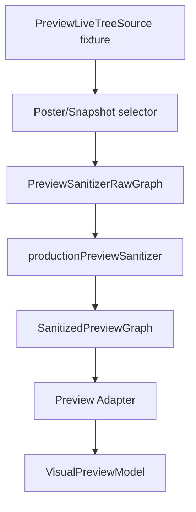

# Visual Publishing Studio Live Selector Implementation Review

- **Status**: `Pass as Minimal Live Selector Layer`
- **Readiness**: `Ready for Hidden Studio Wiring Planning`
- **Connectivity**: `Selectors Not Registered for Runtime`
- **Date**: 2026-07-09

---

## 1. Scope

This review covers the minimal live selector layer:

- `selectPosterPreviewGraph`
- `selectSnapshotPreviewGraph`
- `PreviewLiveTreeSource`
- fixture/store-shaped privacy regression tests

The selectors work with minimal source-shaped inputs and produce `PreviewSanitizerRawGraph`. They do not read `useAppStore`, IndexedDB, or runtime viewport state directly.

---

## 2. Verified Flow



---

## 3. Safety Checklist

| Rule | Status | Notes |
|---|---|---|
| Poster selector implemented | Verified | Root/depth-limited ancestor selection. |
| Snapshot selector implemented | Verified | Explicit visible-node selection only. |
| No full-tree snapshot traversal | Verified | Snapshot selector requires `visibleNodeIds`. |
| No runtime registry activation | Verified | `getVisualPreviewGraphSelector` still returns undefined. |
| No Studio wiring | Verified | Studio components were not changed. |
| No IndexedDB reads | Verified | No persistence imports. |
| No `AppStore` imports | Verified | Selectors use local minimal source shapes. |
| Sanitizer remains required | Verified | Tests pass selector output through `productionPreviewSanitizer`. |
| Adapter receives sanitized graph | Verified | Tests pass sanitized graph into poster/snapshot adapters. |
| Raw IDs excluded from adapter model | Verified | Tests assert raw ids do not appear in `VisualPreviewModel`. |

---

## 4. Decision

The minimal selector layer is approved as a safe data selection foundation.

Approved next step:

```text
Phase 4P - Hidden Studio Selector Wiring Planning
```

Still blocked:

- runtime selector registry activation
- actual `useAppStore` subscription
- IndexedDB reads
- enabling Visual Studio shell for users
- export handler wiring
