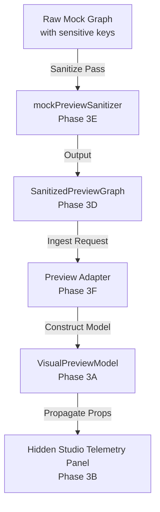

# Visual Publishing Studio Preview Adapter Foundation Review

- **Status**: `Pass as Preview Adapter Foundation`
- **Readiness**: `Ready for Preview Runtime Integration Planning`
- **Connectivity**: `Not Connected to Real Tree Data`
- **Review Date**: 2026-07-08

---

## 1. Overview & Scope

This review documents the structural signoff and safety validation of the **Visual Publishing Studio Preview Adapter Foundation** (Phases 3A to 3F). The foundation provides a sandboxed contract layer that prepares the publishing engine for dynamic layout previews without exposing raw user records or database structures.

The review covers:
- **Phase 3A**: Preview Adapter Contract Types & Registry.
- **Phase 3B**: Hidden Mock Preview Model Integration inside `VisualPublishingStudio`.
- **Phase 3C**: Sanitized Tree Data Boundary Design.
- **Phase 3D**: Sanitizer Generic Interface & Node Shapes.
- **Phase 3E**: Static Sanitizer Mock Implementation (`mockPreviewSanitizer`).
- **Phase 3F**: Adapter Integration mapping `SanitizedPreviewGraph` to Layout Telemetry.

---

## 2. Architecture & Data Flow

The following flow represents the isolated preview pipeline:

---

## 3. Safety Checklist

| Rule | Status | Validation Summary |
|---|---|---|
| **No Store Access** | ✅ Verified | No references to Redux, context, or IndexedDB in sanitizer/adapters. |
| **No Export Wiring** | ✅ Verified | Sanitizer and preview adapters never invoke `onRunExport` or call PDF/PNG engines. |
| **No Raw Identifiers** | ✅ Verified | Every raw database record key is mapped to a session-isolated `preview-node-${index}` key. |
| **Forbidden Fields Redacted** | ✅ Verified | Emails, phones, addresses, notes, and citations are completely stripped from sanitized shapes. |
| **Safe Masking Policies** | ✅ Verified | Living or private people are mapped to localized placeholders (`Masked person` / `شخص مخفي`). |
| **Photo Silhouetting** | ✅ Verified | Profile photo paths are blocked when masked or when policy prohibits photos. |
| **Date Truncation** | ✅ Verified | Full birth/death dates are truncated to year-only numbers, and completely blocked for living/masked profiles. |
| **Node limits Cap** | ✅ Verified | Truncates nodes list to policy limits, sets `metadata.truncated` to true, and drops orphan edges. |
| **Owner-Full Mode Protection**| ✅ Verified | `owner-full` mode allows public ancestor names but continues to strip contact information and notes. |
| **Graceful Mock Fallback** | ✅ Verified | Retains dummy placeholders inside registry when request leaves `sanitizedGraph` parameter undefined. |

---

## 4. Final Signoff Decision

The Preview Adapter Foundation successfully **passes validation**. The architecture ensures complete isolation of layout rendering from database entity definitions, complying with **ADR 014** privacy boundaries. 

The project is **Ready for Phase 4A: Preview Runtime Integration Planning** to design the database query sanitizer and hook layout updates to user modifications safely. No runtime promotion of live tree data has been enabled.
