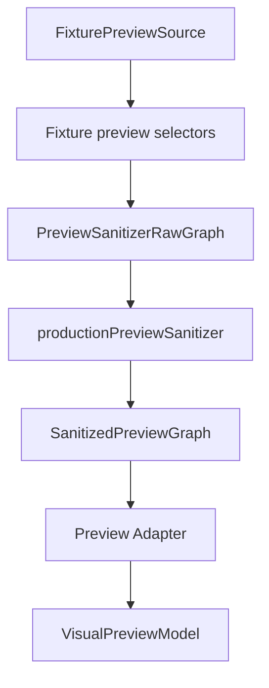

# Visual Publishing Studio Runtime Selector Foundation Review

- **Status**: `Pass as Runtime Selector Foundation`
- **Readiness**: `Ready for Live Store Selector Planning`
- **Connectivity**: `Not Connected to Store or IndexedDB`
- **Review Date**: 2026-07-09

---

## 1. Scope

This review closes the runtime selector foundation package covering Phases 4A through 4D. The goal of this package was to prepare the safe bridge toward future live tree previews without enabling runtime data access.

The reviewed scope includes:

- **Phase 4A**: Preview Runtime Integration Planning.
- **Phase 4B**: Production Preview Sanitizer Skeleton.
- **Phase 4C**: Preview Raw Graph Selector Contract.
- **Phase 4D**: Fixture Selector Implementation.

---

## 2. Architecture Flow Verified

The fixture-only chain now verifies the future live-data shape without touching the live tree store:



The runtime selector registry remains intentionally empty:

```text
listVisualPreviewGraphSelectors() -> []
getVisualPreviewGraphSelector('poster') -> undefined
getVisualPreviewGraphSelector('snapshot') -> undefined
```

---

## 3. Safety Checklist

| Rule | Status | Verification |
|---|---|---|
| Runtime selector registry remains empty | Verified | Phase 4C tests assert no runtime selectors are registered. |
| Fixture selectors are separate from runtime selectors | Verified | Fixture selectors are exported from `previewFixtureGraphSelectors.ts`, not from the runtime registry. |
| No Store/IndexedDB imports | Verified | Selector contract tests inspect source and reject store/indexed/domain imports. |
| Selectors output production sanitizer shape only | Verified | `VisualPreviewGraphSelector` returns only `PreviewSanitizerRawGraph`. |
| Contact/media fields excluded at compile level | Verified | Tests assert `email`, `phone`, and `photoUrl` are rejected by raw node types. |
| Fixture IDs do not reach adapter model | Verified | Fixture chain tests serialize `VisualPreviewModel` and reject fixture IDs. |
| Production sanitizer remains the boundary | Verified | Fixture chain passes through `productionPreviewSanitizer` before adapter ingestion. |
| No Studio wiring | Verified | Phase 4A-4D do not modify `VisualPublishingStudio` runtime behavior. |
| No export wiring | Verified | No PDF/PNG handlers or export runners are invoked by selectors or sanitizer tests. |

---

## 4. Decision

The runtime selector foundation passes as a safe architectural foundation.

- **Approved State**: `Pass as Runtime Selector Foundation`
- **Allowed Next Step**: `Live Store Selector Planning`
- **Still Blocked**: Direct live store runtime wiring into Studio preview
- **Still Required Before Runtime**:
  - Product-specific live selector design.
  - Privacy policy mapper design.
  - Live selector privacy regression tests.
  - Performance caps and profiling strategy.

No user-facing behavior has changed.
