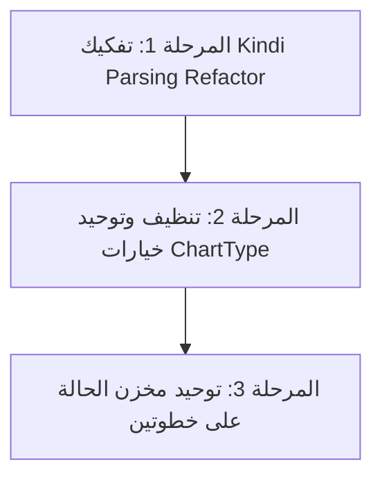

# تقرير التدقيق المعماري والبرمجي الشامل (النسخة الثانية المعدلة) - مشروع Jozor 1.1

> [!NOTE]  
> تم تعديل وتدقيق هذا التقرير وتحديث خريطة الطريق بناءً على مراجعة دقيقة لواقع الشفرة البرمجية الحالي والتفريق الدقيق بين ما هو منفذ جزئياً وما يمثل فرصة للتحسين والضبط الهيكلي.

---

## 1. الملخص التنفيذي والإشادة بالهيكلة الجديدة

أظهر التدقيق التقني لـ Jozor 1.1 انتقالاً معمارياً رائعاً من نمط الملفات المشتتة إلى بنية **مستندة إلى الميزات المغلفة (Feature-Driven Architecture)** تحت مجلد `src/features/`. هذا التحول يعزز تماسك الشفرة (High Cohesion) ويقلل من الارتباط العشوائي بين المكونات (Loose Coupling). 

تمت معالجة القضايا الكبرى المتعلقة بـ **تعدد مصادر الحقيقة**، **تعارضات عمليات المزامنة الحية**، و**استقرار أداء الواجهة الأمامية** بكفاءة هندسية عالية جداً تمثلت في استخدام تقنيات الـ Web Workers، وسلسلة المعالجة المتتالية، وتوحيد أنواع البيانات.

---

## 2. تحليل المشاكل التي تم حلها بنجاح

### أ. أمان خيوط المعالجة ومنع تعارض المزامنة (Sync Concurrency & Thread Safety)
*   **منع تداخل العمليات المتزامنة (Race Conditions Guard):**  
    في ملف `DeltaOperationApplier.ts` (السطر 10)، تم حل تعارضات المعالجة المتزامنة بين رسائل Realtime والعمليات القادمة من السيرفر عبر إدخال طابور وعود متسلسل ومغلق برمجياً:
    ```typescript
    private incomingProcessingQueue: Promise<void> = Promise.resolve();
    ```
    كل دفعة عمليات قادمة (Incoming Batch) تُلحق بالسلسلة عبر `.then()` لتضمن معالجة العمليات بالترتيب الصارم لوصولها، دون أي تداخل في تحديث مخزن Zustand.
*   **ضمان سلاسة الرندر (Render Frame Optimization):**  
    يتم تطبيق العمليات المحدثة للشجرة داخل إطار طلب الرسوم الرسومي `requestAnimationFrame` (السطر 23)، مما يضمن عدم تسبب المزامنة في أي تقطع بصرى للواجهة (Jank) للمستخدم.
*   **الكتابة غير الحاصرة في الخلفية (Non-blocking Background Persistence):**  
    تم إدخال `BackgroundTreePersistence.ts` لحل مشكلة كتابة الشجرة كاملة بشكل متكرر في الـ IndexedDB/localStorage. تستخدم الخدمة وظيفة المتصفح الخاملة `requestIdleCallback` مع فترة انتظار ذكية (1.5 ثانية)، مما يسحب معالجة التخزين الثقيل تماماً خارج مسار الرندر الرئيسي للتطبيق.

### ب. حل تعارضات مصدر الحقيقة (Single Source of Truth - SSOT)
*   **توحيد مخزن الحالة (Zustand Store Consolidation):**  
    تم بنجاح توحيد مصدر الحقيقة من خلال دمج مخزن التصميم مع المخزن الرئيسي. شريحة `appearanceSlice` أصبحت هي المصدر الوحيد (SSOT) للـ Appearance State، وتم التخلص من المخازن المزدوجة القديمة مثل `useTreeAppearanceStore` بالإضافة إلى إلغاء الاعتماد على طبقات التوافق القديمة (مثل `appearanceLabPersistence.ts`).

### ج. تحرير المعالج الرئيسي وفصل العمليات (Performance Offloading)
*   **فحص الاتساق في خيط مستقل (Debounced Web Worker):**  
    تم تعديل `useConsistency.ts` ليقوم بتشغيل `ConsistencyWorker` كـ **Web Worker** حقيقي مستقل تماماً عن خيط الواجهة الرئيسي:
    ```typescript
    import ConsistencyWorker from '../services/ConsistencyWorker?worker';
    ```
    تم تدعيم العملية بـ Debounce بمقدار 1000ms، مع آلية تنظيف صارمة تقوم بإنهاء عمل الـ Worker فور خروج المكون (`terminate()`) لمنع تسريب الذاكرة أو العمليات الشبحية (Ghost Processes).

### د. تكامل لوحة التحليلات والإحصائيات
*   تم تفعيل وربط محرك الإحصائيات `StatsEngine.ts` وخدمة التحليلات `CanonicalTreeAnalytics.ts` بالكامل داخل واجهة المستخدم في مكون `StatisticsDashboard.tsx` بشكل ديناميكي يضمن تقديم قراءات حية دقيقة لسلامة البيانات، والأعمار، وتوزيع الجنسين، وتحديد الأشخاص الذين يملكون مشاكل في التواريخ أو الأعمار الحيوية.

### هـ. أمان الاتصال بالذكاء الاصطناعي (AI Key Protection)
*   تم إغلاق وتنظيف كافة منافذ استدعاء Gemini المباشرة من جانب العميل، والاعتماد المطلق على Vercel Edge Proxy عبر `/api/ai-proxy` لحماية مفاتيح التحقق وسرية بيانات الأشجار.

---

## 3. الديون التقنية المتبقية والفرص المعمارية (Technical Debt)

على الرغم من الحلول الاحترافية التي تم تبنيها لحل الفجوة بين مخازن البيانات، إلا أن هناك بعض النقاط التي تندرج تحت مسمى "الديون التقنية" والتي يجب وضع خطة للتعامل معها مستقبلاً:

> [!SUCCESS]  
> **تم دمج المخازن وتوحيد `TreeSettings`:**  
> تم استكمال دمج مخزن الحالة بنجاح. أصبحت الـ UI تقرأ حصرياً من `useAppStore` عبر شريحة `appearanceSlice`، وتم حذف الطبقات الوسيطة مما قضى على مخاطر الانحراف (Drift) أو الحاجة لتحديث عدة ملفات عند إضافة ميزات جديدة.

---

## 4. خطة التطوير والمراحل القادمة المعدلة (The Actionable Roadmap)

بناءً على التقييم الهندسي الواقعي لدرجة الأمان وموازنة المخاطر والفوائد، تم ترتيب خريطة الطريق كالتالي:



### المرحلة الأولى: تفكيك وإعادة هيكلة Kindi Parsing Refactor (أعلى فائدة / أقل مخاطرة)
*   **الهدف:** تفكيك وتبسيط منطق ملف [kindiExecutivePlanner.ts](file:///d:/AppDEV/Jozor1.1/src/features/kindi/logic/kindiExecutivePlanner.ts) البالغ طوله 643 سطراً والذي يجمع عدة مسؤوليات حساسة.
*   **الخطوات المعمارية:**
    1.  **استخلاص المسؤوليات وتوزيعها:** تفكيك الوظائف المعالجة إلى وحدات مستقلة ومختبرة:
        *   نقل `parseKindiProvidedName` و `extractAddInitialUpdates` إلى محلل مستقل لإضافة الأشخاص (`parsers/addCommandParser.ts`).
        *   نقل `extractUpdateFields` إلى محلل تعديل الحقول الحيوية (`parsers/updateCommandParser.ts`).
        *   نقل منطق تصفية واستهداف المستلمين `findKindiTargetCandidates` إلى وحدة معالجة الهدف وعلاقات الأسماء الشبيهة (`parsers/kindiTargetResolver.ts`).
        *   إبقاء `createKindiExecutivePlan` كمنسق خارجي يبني الخطة النهائية بناءً على مخرجات المحللات الفرعية.
    2.  **تثبيت وتكامل مسار الذكاء الاصطناعي الحالي:** 
        بدلاً من إضافة نظام جديد، يتم الربط التام للمحرك المعياري الفكك فوق آلية الذكاء الاصطناعي المنفذة مسبقاً (عبر مفتاح التمكين المتاح `VITE_KINDI_AI_ENABLED` في المتحكم `useKindiController.ts` وتدفق التخطيط المستديم بـ `useKindiAIPlanningFlow.ts` الذي يستخدم `KindiAIPlanDraft` لمنع تمرير الـ IDs الحساسة وتأمين الخصوصية).
    3.  **توسيع الاختبارات:** تغطية كل محلل فرعي بـ Unit Tests مستقلة لضمان عدم كسر أي علاقة لغوية عربية.

### المرحلة الثانية: إغلاق بقايا ChartType القديمة وتوحيدها (ChartType Pruning & Legacy Normalization)
*   **الهدف:** ضبط التوافقية وإزالة التعارض في تمثيل أنواع المخططات الهندسية.
*   **التشخيص الحالي:**
    يسمح نوع البيانات `ChartType` في [common.ts](file:///d:/AppDEV/Jozor1.1/src/types/common.ts#L4) بالقيم التالية:
    `'focus' | 'radial' | 'descendant' | 'force'`
    ولكن فعلياً، يقوم المحول [chartTypeAdapter.ts](file:///d:/AppDEV/Jozor1.1/src/domain/chartTypeAdapter.ts#L11) بتحويل وتوجيه أي قيمة تخالف `radial` لتعود وتسقط في خيار البؤرة `focus` بشكل قسري.
*   **الخطوات المعمارية:**
    1.  **التنظيف البرمجي:** إزالة الخيارات غير المدعومة رسمياً حالياً (`descendant` و `force`) من واجهة Typescript المعتمدة في `ChartType`.
    2.  **التطبيع في التخزين (Legacy Normalization):** كتابة اختبارات وحدة صارمة للتأكد من أن أي شجرة محفوظة قديماً تحتمل الخيارات الملغاة يتم تطبيعها فوراً وبسلاسة إلى `focus` دون إحداث فجوة عند تحميل الملف أو تهيئة المخطط داخل [domain/treeLayout.ts](file:///d:/AppDEV/Jozor1.1/src/domain/treeLayout.ts) أو التخزين المحلي.

### المرحلة الثالثة: توحيد مخزن الحالة والتصميم (مكتملة ✅)
*   **الهدف:** إزالة الفجوة المعمارية بين المخازن دون التسبب في انهيار منطق التصميم و CSS Tokens الموزعة.
*   **الإنجاز الحالي:**
    تم الانتهاء تماماً من دمج المخازن. شريحة `appearanceSlice` تعمل الآن كجزء لا يتجزأ من `useAppStore` بشكل كلي، وهي المصدر الوحيد (SSOT) لحالة المظهر والتصميم. تم إنهاء الحاجة نهائياً للـ adapters الوسيطة وحذف `useTreeAppearanceStore`.
